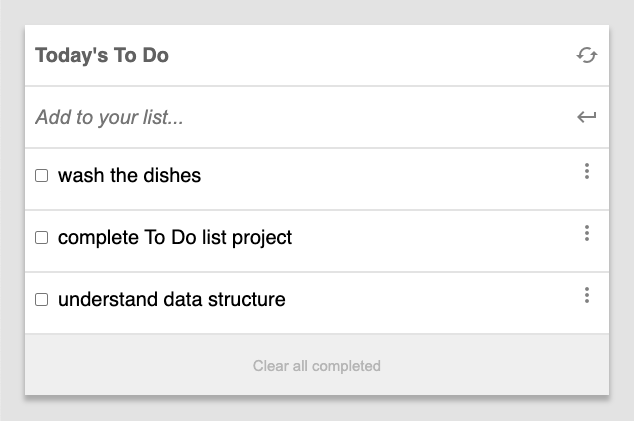

#To Do List

> This is about using webpack to built our project.



Mobile Screenshoot

## Link of Web Page

- GitHub Pages: [@eri8-9](https://eri8-9.github.io/todo-list/dist/)

## Built With

- HTML, CSS & JS
- Webpack, jest & babel

## Skills

  - Systematic
  - Creative
  - Persistent

## Getting Started

### Prerequisites
  - Read about [webpack](https://webpack.js.org/guides/getting-started/) before start.
  - Read about [AAA](https://medium.com/@pjbgf/title-testing-code-ocd-and-the-aaa-pattern-df453975ab80).

### Setup
  - Better have [VS Code](https://code.visualstudio.com/) installed or install the source-code editor of your preference. 
    - Take a look at this guidelines [jest](https://github.com/microverseinc/curriculum-transversal-skills/blob/main/testing/lesson_unit_tests_in_javascript.md)
### Install
  - In the terminal go to the folder you going to work and write the next. 
  ```
  git clone https://github.com/eri8-9/to-do-list.git
  ```
  - Next go to VS Code editor and open the folder where you installed the repository.
### Usage
  - Don't forget to create a branch to star working on the project.
  - Now that you have everything set up you are ready to work.

## Authors

👤 **Christian Erick Contreras**

- GitHub: [@eri8-9](https://github.com/eri8-9)
- Linkedin: [LinkedIn](https:linkedin.com/in/christian-erick-contreras-9945b820b)
- Twitter: [@ChristianErick_](https://twitter.com/ChristianErick_)

## Show your support

Give a ⭐️ if you like this project!

## Acknowledgments

- Microverse

## 📝 License

This project is [MIT](LICENSE) licensed.